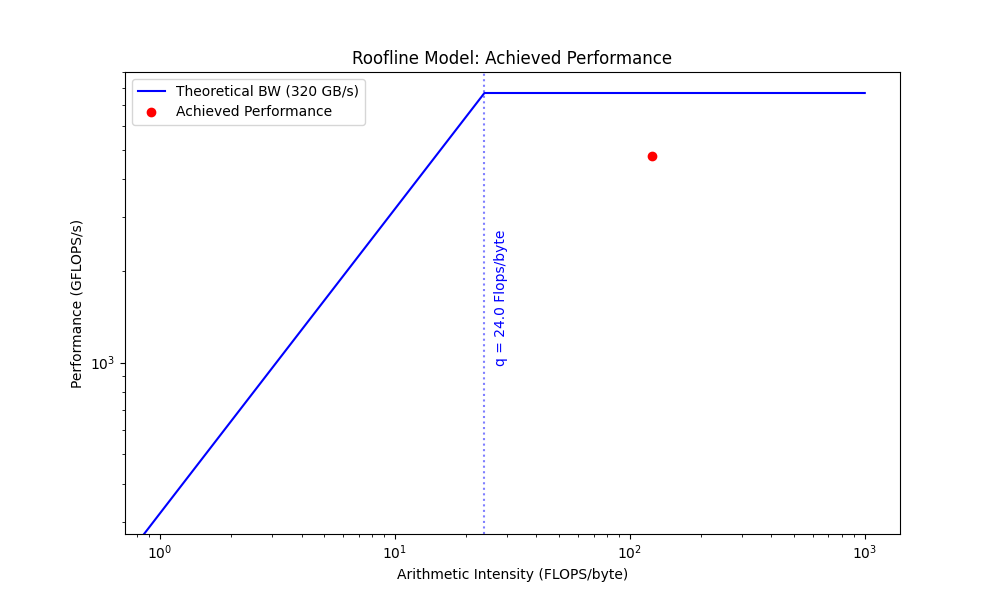

# cuda-sgemm

A high-performance single-precision matrix-multiply (SGEMM) CUDA kernel, tuned for
the NVIDIA T4. It reaches **4779.9 GFLOP/s at N = 2048** — approaching cuBLAS —
through global-memory coalescing, shared-memory tiling, and two-dimensional register
blocking.

Developed and benchmarked on an NVIDIA T4. Full write-up, including the roofline and
occupancy analysis: **[docs/report.pdf](docs/report.pdf)** (LaTeX source in
[`docs/report/`](docs/report/)).

## Approach

- **Two-dimensional block tiling.** 16×16 thread blocks, each computing a 128×128
  output tile of C (an 8×8 micro-tile per thread) over 32-deep K sub-tiles staged in
  shared memory.
- **Coalesced global loads + shared-memory staging**, with bounds checking so
  matrix sizes that are not multiples of 128 stay correct.
- **Register-blocked outer products** with `#pragma unroll` to expose
  instruction-level parallelism.
- **Roofline / occupancy analysis** of register pressure and arithmetic intensity to
  explain where the kernel is compute- vs. memory-bound (see the report).
- Bonus: a **non-square** matrix-multiply kernel.

## Results (NVIDIA T4)

| N | Peak GFLOP/s | Thread-block config |
|---|---|---|
| 256 | 1148.9 | `bx=16 by=16 tm=4 tn=4` |
| 512 | 2166.9 | `bx=16 by=16 tm=8 tn=8` |
| 1024 | 3919.6 | `bx=16 by=16 tm=8 tn=8` |
| 2048 | 4779.9 | `bx=16 by=16 tm=8 tn=8` |



## Follow-ups on a GB10

[`next/sgemm_next.cu`](next/sgemm_next.cu) holds every kernel below (k0–k15) and
benchmarks each against cuBLAS (FP32, TF32 off). Measured on an NVIDIA GB10
(Blackwell, 48 SMs), so the numbers are **not comparable** with the T4 results
above. All tables below come from one session on an otherwise idle machine: each
number is the median over 3 runs of the 7-run median. Runs vary by up to ~5%,
since the GB10 hits its power cap during SGEMM.

```bash
cd next
nvcc -O3 -std=c++17 -arch=sm_121 -o sgemm_next sgemm_next.cu -lcublas   # use your GPU's sm_XX
./sgemm_next 1024 1025 2048 2049 4096
```

### Round two: the report's next steps

k0–k5 apply the report's "next steps" one at a time on top of the course kernel.

| Step | N=2048 GFLOP/s | vs cuBLAS | N=4096 GFLOP/s | vs cuBLAS |
|---|---|---|---|---|
| Course kernel | 9,661 | 60% | 10,723 | 63% |
| + `__launch_bounds__(256,2)` | 11,508 | 71% | 12,616 | 74% |
| + `float4` loads, A transposed in smem | 13,882 | 86% | 14,181 | 83% |
| + conflict-free smem reads | 14,323 | 88% | 14,623 | 85% |
| + warp tiling (BK=32 / BK=16) | 14,234 / 14,687 | 88% / 91% | 14,812 / 15,209 | 87% / 89% |
| + double buffering (BK=16) | 14,933 | 92% | 15,392 | 90% |
| cuBLAS | 16,204 | 100% | 17,119 | 100% |

### Round three: closing the gap to cuBLAS

k6–k11, from the same runs as round two.

| Step | N=2048 GFLOP/s | vs cuBLAS | N=4096 GFLOP/s | vs cuBLAS |
|---|---|---|---|---|
| k5 (from round two) | 14,933 | 92% | 15,392 | 90% |
| k6 B column pairs swapped (dropped) | 14,604 | 90% | 15,390 | 90% |
| k7 `cp.async`, k5 tiling (dropped) | 14,490 | 89% | 15,384 | 90% |
| **k8 128×256 tile, 16×8 per thread, `cp.async`** | **16,625** | **103%** | **17,839** | **104%** |
| k9 k8 + split-K=3 (dropped at these sizes) | 15,101 | 93% | 16,272 | 95% |
| k10 128×128 tile, 16×8 per thread, A k-major | 16,581 | 102% | 17,615 | 103% |
| k11 picks k8/k9/k10 per size (= k8 here) | 16,932 | 104% | 17,752 | 104% |
| cuBLAS (same runs) | 16,204 | 100% | 17,119 | 100% |

### Round four: odd sizes and the last wave

k12–k15, from the same runs. N=2049 is added because it leaves the last wave of
128×256 tiles partial, which is what k14 targets.

| Step | N=2048 | vs cuBLAS | N=2049 | vs cuBLAS | N=4096 | vs cuBLAS |
|---|---|---|---|---|---|---|
| k8 (from round three) | 16,625 | 103% | 13,172 | 105% | 17,839 | 104% |
| k11 (from round three) | 16,932 | 104% | 14,297 | 114% | 17,752 | 104% |
| k12 k-major A at 128×256, register cap (dropped) | 16,535 | 102% | 12,496 | 99% | 17,305 | 101% |
| k13 k8 with 4×4-lane half-warps, as cuBLAS (dropped, = k8; ncu: 25% more shared-load wavefronts, not fewer) | 16,927 | 104% | 13,127 | 104% | 17,646 | 103% |
| **k14 k8 + last partial wave split into K pieces over all SMs** | **17,333** | **107%** | **14,663** | **117%** | **18,057** | **105%** |
| k15 k11 below one wave of tiles, else k14 | 17,471 | 108% | 14,595 | 116% | 18,020 | 105% |
| cuBLAS (same runs) | 16,204 | 100% | 12,578 | 100% | 17,119 | 100% |

## Layout

| Path | Contents |
|---|---|
| `kernel/` | **The core of the project** — the tuned CUDA kernel (`mmpy_kernel.cu`), grid setup (`setGrid.cu`), and tuning parameters (`OPTIONS.txt`). |
| `src/` | Benchmarking / host harness (provided by the course). |
| `build/` | Makefile and CUDA build configuration. |
| `tools/` | Profiling scripts (`run_ncu.sh`, `run_nvprof.sh`) and roofline plotting (`plot_roofline.py`). |
| `docs/` | Report and roofline figures. |

## Build & run

Requires a CUDA toolkit and an NVIDIA GPU (developed and benchmarked on a T4). Build
flags are read from `kernel/OPTIONS.txt`.

```bash
# build (for a T4; on another GPU add SM=<compute capability>, e.g. SM=121 on a GB10)
make -C build `cat kernel/OPTIONS.txt`

# build with a cuBLAS reference for comparison
make -C build cublastest=1 `cat kernel/OPTIONS.txt`

# run at a given size
./mmpy `cat kernel/OPTIONS_RUNTIME.txt` -n 2048

# clean
make -C build clean
```

## Authors

Aaron Ang and Jerry Ma. The `src/` benchmarking harness is provided starter code; the
CUDA kernel and tuning in `kernel/` are our work.
